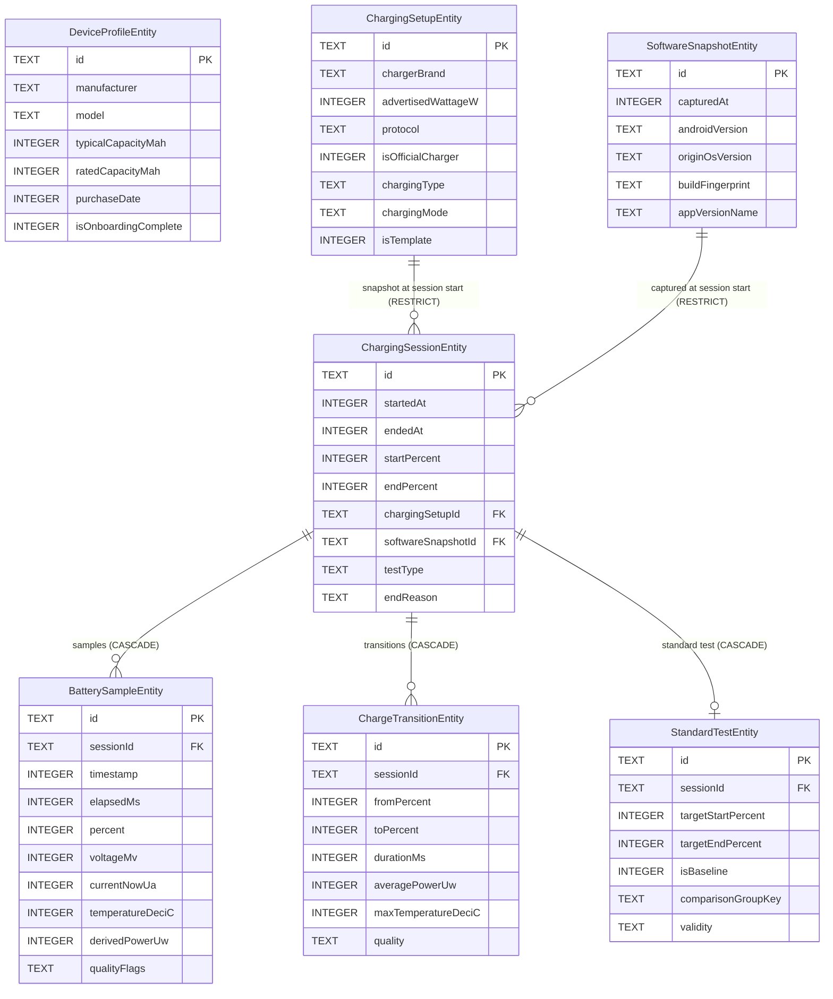

# ChargeTrack — Pre-Prompt 06 Schema Contract & Data Integrity Review (Corrected)

**Target Device:** iQOO 15 (OriginOS 6 / Android 16)  
**Database:** Room 2.7+ (SQLite)  
**Review Status:** Pre-Implementation Architectural Verification — Final Approved Contract

---

## 1. Current Implementation Findings (Prompts 01–05)

A comprehensive inspection of the existing codebase confirms the following state:

### Implemented & Tested Components
1. **Core Domain Models** (`domain/model/`):
   - [`DeviceProfile`](file:///c:/Users/Maximus/Documents/Personal%20Projects/battery-monitor/app/src/main/java/com/example/chargetrack/domain/model/DeviceProfile.kt): Segregates device-reported Build fields, manufacturer reference spec (iQOO 15: 7000 mAh / 26.25 Wh / 100 W), and user-entered metadata.
   - [`SoftwareSnapshot`](file:///c:/Users/Maximus/Documents/Personal%20Projects/battery-monitor/app/src/main/java/com/example/chargetrack/domain/model/SoftwareSnapshot.kt): Captures Android version, SDK level, OriginOS build label, build fingerprint, and app version.
   - [`ChargingSetup`](file:///c:/Users/Maximus/Documents/Personal%20Projects/battery-monitor/app/src/main/java/com/example/chargetrack/domain/model/ChargingSetup.kt): Captures charger/cable brand, model, advertised wattage, protocol, charging type, and mode.
   - [`ChargingSession`](file:///c:/Users/Maximus/Documents/Personal%20Projects/battery-monitor/app/src/main/java/com/example/chargetrack/domain/model/ChargingSession.kt): Bounded charging event with strict invariants (`startPercent`, `endPercent`, `startedAt <= endedAt`, `endedAt == null` iff `endReason == null`).
   - [`BatterySample`](file:///c:/Users/Maximus/Documents/Personal%20Projects/battery-monitor/app/src/main/java/com/example/chargetrack/domain/model/BatterySample.kt): 5-second measurement record preserving raw nullable values (never coercing unavailable fields to `0`).
   - [`ChargeTransition`](file:///c:/Users/Maximus/Documents/Personal%20Projects/battery-monitor/app/src/main/java/com/example/chargetrack/domain/model/ChargeTransition.kt): Per-1% transition summary with power/temperature aggregates and data quality rating.
   - [`StandardTest`](file:///c:/Users/Maximus/Documents/Personal%20Projects/battery-monitor/app/src/main/java/com/example/chargetrack/domain/model/StandardTest.kt): Target percentage bounds (default 20→80%), user-designated baseline (`isBaseline`, `baselineSetAt`), non-null comparison group key (`comparisonGroupKey: String`), and 3-state validity (`VALID`, `QUESTIONABLE`, `INVALID`).
2. **Domain Enums** (`domain/enums/`):
   - `ChargingType`, `ChargingMode`, `SessionEndReason`, `TestType`, `DataQuality`, `QualityFlag`, `TestValidity`.
3. **Hardware Battery Layer** (`data/battery/` & `domain/battery/`):
   - `BatteryManagerDataSource`: Reads `ACTION_BATTERY_CHANGED` sticky intent + `BatteryManager` properties on `Dispatchers.IO`.
   - `BatterySnapshotConverter`: Pure, zero-Android-dependency converter handling `INT_MIN`/`LONG_MIN`/`-1` unavailability sentinels.
4. **Device Profile & Identification Layer** (`domain/device/` & `data/device/`):
   - `DeviceIdentifier`, `Iqoo15ReferenceData`, `OriginOsBuildLabelExtractor`, `DeviceProfileFactory`, `BuildInfoReader`.
5. **Diagnostics UI** (`ui/diagnostics/`):
   - `DiagnosticsViewModel`, `DiagnosticsScreen`, `DiagnosticsFormatter` displaying raw vs reference vs derived values.

---

## 2. Refinements Applied to Final Contract

| Area | Contract Rule |
|---|---|
| **`ChargingSetup` Historical Integrity** | A session captures an immutable snapshot of charger, cable, charging type, and mode at **SESSION START**. Modifying reusable template configurations in the UI creates a new configuration record and **never** mutates the snapshot record attached to active or completed historical sessions. |
| **Monotonic Timing Source** | Wall-clock time is not authoritative for elapsed-duration measurement because the device/network can adjust the system wall clock. `Instant` remains a valid absolute timestamp for historical event time, but `SystemClock.elapsedRealtime()` is the authoritative source for charging duration (since it is strictly monotonic and includes deep sleep). Transition `durationMs` is computed strictly via `toSample.elapsedMs - fromSample.elapsedMs`. |
| **`StandardTest` Comparison Group** | `comparisonGroupKey` is strictly `String` (non-null, non-blank) on both the domain model and database entity. Every Standard Test belongs to a deterministic comparison group (e.g. `standard_20_80_wired_official`, `standard_20_80_wireless`). |
| **Reboot / Session Boundary** | A `ChargingSession` cannot continue across a device reboot. If the device reboots, the active session must be finalized with `SessionEndReason.DEVICE_RESTARTED`. Session-relative `elapsedRealtime()` values must never be interpreted across a reboot. |
| **Duplicate Sample Semantics** | `(sessionId, elapsedMs) UNIQUE` with `OnConflictStrategy.IGNORE` protects against idempotent retries. The repository layer distinguishes: (1) `Inserted`, (2) `DuplicateIgnored`, (3) `Failed`. |
| **Enum Serialization** | `RoomTypeConverters` uses explicit, canonical string tokens (e.g. `"flash_charge"`, `"good"`) with safe fallback values (`UNKNOWN`, `INVALID`) rather than throwing `IllegalArgumentException`. |
| **Performance Target** | Indexes are structured for high efficiency over multi-year datasets, targeting sub-10ms UI queries as a design goal, while prioritizing data integrity. |

---

## 3. Final Entity Schema Contract

### 3.1 `device_profiles` Table
Stores device hardware identity, manufacturer reference specs, and user setup metadata. Single active profile in V1.

| Field Name | Kotlin Type | SQLite Type | Nullable | Measurement Category | Mutability | Index / Constraint |
|---|---|---|---|---|---|---|
| `id` | `String` | `TEXT` | Non-Null | System | Immutable | Primary Key |
| `manufacturer` | `String` | `TEXT` | Non-Null | Device-reported | Read-only | — |
| `brand` | `String` | `TEXT` | Non-Null | Device-reported | Read-only | — |
| `model` | `String` | `TEXT` | Non-Null | Device-reported | Read-only | — |
| `device` | `String` | `TEXT` | Non-Null | Device-reported | Read-only | — |
| `product` | `String` | `TEXT` | Non-Null | Device-reported | Read-only | — |
| `androidVersion` | `String` | `TEXT` | Non-Null | Device-reported | Read-only | — |
| `sdkInt` | `Int` | `INTEGER` | Non-Null | Device-reported | Read-only | — |
| `buildFingerprint` | `String` | `TEXT` | Non-Null | Device-reported | Read-only | — |
| `buildDisplay` | `String` | `TEXT` | Non-Null | Device-reported | Read-only | — |
| `buildIncremental` | `String` | `TEXT` | Non-Null | Device-reported | Read-only | — |
| `originOsBuildLabel` | `String?` | `TEXT` | Nullable | Device-reported / Inferred | Read-only | — |
| `matchedDeviceName` | `String?` | `TEXT` | Nullable | Inferred | Read-only | — |
| `typicalCapacityMah` | `Int?` | `INTEGER` | Nullable | Manufacturer Ref (7000 mAh) | Read-only | — |
| `ratedCapacityMah` | `Int?` | `INTEGER` | Nullable | Manufacturer Ref (6830 mAh) | Read-only | — |
| `typicalEnergyWh` | `Double?` | `REAL` | Nullable | Manufacturer Ref (26.25 Wh) | Read-only | — |
| `ratedEnergyWh` | `Double?` | `REAL` | Nullable | Manufacturer Ref (25.62 Wh) | Read-only | — |
| `wiredReferenceW` | `Int?` | `INTEGER` | Nullable | Manufacturer Ref (100 W) | Read-only | — |
| `wirelessReferenceW` | `Int?` | `INTEGER` | Nullable | Manufacturer Ref (40 W) | Read-only | — |
| `nickname` | `String?` | `TEXT` | Nullable | User-entered | Mutable | — |
| `purchaseDate` | `LocalDate?` | `INTEGER` (epoch day) | Nullable | User-entered | Mutable | — |
| `firstUseDate` | `LocalDate?` | `INTEGER` (epoch day) | Nullable | User-entered | Mutable | — |
| `ramStorageVariant` | `String?` | `TEXT` | Nullable | User-entered | Mutable | — |
| `notes` | `String?` | `TEXT` | Nullable | User-entered | Mutable | — |
| `createdAt` | `Instant` | `INTEGER` (epoch ms) | Non-Null | System | Immutable | — |
| `updatedAt` | `Instant` | `INTEGER` (epoch ms) | Non-Null | System | Mutable | — |
| `isOnboardingComplete` | `Boolean` | `INTEGER` (0/1) | Non-Null | User-entered | Mutable | — |

---

### 3.2 `software_snapshots` Table
Immutable point-in-time snapshot of OS and app versions captured at session start.

| Field Name | Kotlin Type | SQLite Type | Nullable | Category | Mutability | Index / Constraint |
|---|---|---|---|---|---|---|
| `id` | `String` | `TEXT` | Non-Null | System | Immutable | Primary Key |
| `capturedAt` | `Instant` | `INTEGER` (epoch ms) | Non-Null | System | Immutable | Index |
| `androidVersion` | `String` | `TEXT` | Non-Null | Device-reported | Immutable | — |
| `sdkInt` | `Int` | `INTEGER` | Non-Null | Device-reported | Immutable | — |
| `originOsVersion` | `String?` | `TEXT` | Nullable | Device-reported / Inferred | Immutable | — |
| `buildFingerprint` | `String` | `TEXT` | Non-Null | Device-reported | Immutable | — |
| `appVersionName` | `String` | `TEXT` | Non-Null | System | Immutable | — |
| `appVersionCode` | `Int` | `INTEGER` | Non-Null | System | Immutable | — |

---

### 3.3 `charging_setups` Table
Charger/cable/mode snapshot record captured at session start (or saved user preset). Immutable once referenced by a session.

| Field Name | Kotlin Type | SQLite Type | Nullable | Category | Mutability | Index / Constraint |
|---|---|---|---|---|---|---|
| `id` | `String` | `TEXT` | Non-Null | System | Immutable | Primary Key |
| `chargerBrand` | `String?` | `TEXT` | Nullable | User-entered | Immutable for session snapshot | — |
| `chargerModel` | `String?` | `TEXT` | Nullable | User-entered | Immutable for session snapshot | — |
| `advertisedWattageW` | `Int?` | `INTEGER` | Nullable | User-entered (label) | Immutable for session snapshot | — |
| `protocol` | `String?` | `TEXT` | Nullable | User-entered (e.g. PPS) | Immutable for session snapshot | — |
| `isOfficialCharger` | `Boolean` | `INTEGER` (0/1) | Non-Null | User-entered | Immutable for session snapshot | — |
| `cableBrand` | `String?` | `TEXT` | Nullable | User-entered | Immutable for session snapshot | — |
| `cableModel` | `String?` | `TEXT` | Nullable | User-entered | Immutable for session snapshot | — |
| `isOfficialCable` | `Boolean` | `INTEGER` (0/1) | Non-Null | User-entered | Immutable for session snapshot | — |
| `chargingType` | `ChargingType` | `TEXT` | Non-Null | User-entered | Immutable for session snapshot | — |
| `chargingMode` | `ChargingMode` | `TEXT` | Non-Null | User-entered | Immutable for session snapshot | — |
| `notes` | `String?` | `TEXT` | Nullable | User-entered | Immutable for session snapshot | — |
| `createdAt` | `Instant` | `INTEGER` (epoch ms) | Non-Null | System | Immutable | — |
| `isTemplate` | `Boolean` | `INTEGER` (0/1) | Non-Null | System | Mutable for user presets | Index |

---

### 3.4 `charging_sessions` Table
Bounded charging event record.

| Field Name | Kotlin Type | SQLite Type | Nullable | Category | Mutability | Index / Constraint |
|---|---|---|---|---|---|---|
| `id` | `String` | `TEXT` | Non-Null | System | Immutable | Primary Key |
| `startedAt` | `Instant` | `INTEGER` (epoch ms) | Non-Null | System | Immutable | Index |
| `endedAt` | `Instant?` | `INTEGER` (epoch ms) | Nullable | System | Mutable (finalized) | Index |
| `startPercent` | `Int` | `INTEGER` | Non-Null | Device-reported | Immutable | — |
| `endPercent` | `Int?` | `INTEGER` | Nullable | Device-reported | Mutable (finalized) | — |
| `chargingSetupId` | `String` | `TEXT` | Non-Null | System | Immutable | FK -> `charging_setups.id` (`RESTRICT`), Index |
| `softwareSnapshotId` | `String` | `TEXT` | Non-Null | System | Immutable | FK -> `software_snapshots.id` (`RESTRICT`), Index |
| `testType` | `TestType` | `TEXT` | Non-Null | User-entered / Inferred | Immutable | Index |
| `userNotes` | `String?` | `TEXT` | Nullable | User-entered | Mutable | — |
| `endReason` | `SessionEndReason?`| `TEXT` | Nullable | Inferred / User-entered | Mutable (finalized) | — |

---

### 3.5 `battery_samples` Table
Raw 5-second measurement samples. High-volume table (~300–450 rows per 30-minute session).

| Field Name | Kotlin Type | SQLite Type | Nullable | Unit | Category | Mutability | Index / Constraint |
|---|---|---|---|---|---|---|---|
| `id` | `String` | `TEXT` | Non-Null | — | System | Immutable | Primary Key |
| `sessionId` | `String` | `TEXT` | Non-Null | — | System | Immutable | FK -> `charging_sessions.id` (`CASCADE`), Index |
| `timestamp` | `Instant` | `INTEGER` | Non-Null | Epoch ms | System (Wall-clock) | Immutable | Index |
| `elapsedMs` | `Long` | `INTEGER` | Non-Null | Milliseconds | System (Monotonic) | Immutable | Unique composite `(sessionId, elapsedMs)` |
| `percent` | `Int?` | `INTEGER` | Nullable | % (0..100) | Device-reported | Immutable | — |
| `voltageMv` | `Int?` | `INTEGER` | Nullable | mV | Device-reported | Immutable | — |
| `currentNowUa` | `Int?` | `INTEGER` | Nullable | µA | Device-reported | Immutable | — |
| `currentAverageUa` | `Int?` | `INTEGER` | Nullable | µA | Device-reported | Immutable | — |
| `chargeCounterUah` | `Int?` | `INTEGER` | Nullable | µAh | Device-reported | Immutable | — |
| `energyCounterNwh` | `Long?` | `INTEGER` | Nullable | nWh | Device-reported | Immutable | — |
| `temperatureDeciC` | `Int?` | `INTEGER` | Nullable | 0.1 °C | Device-reported | Immutable | — |
| `batteryStatus` | `Int?` | `INTEGER` | Nullable | Constant | Device-reported | Immutable | — |
| `pluggedType` | `Int?` | `INTEGER` | Nullable | Constant | Device-reported | Immutable | — |
| `cycleCount` | `Int?` | `INTEGER` | Nullable | Cycles | Device-reported | Immutable | — |
| `derivedPowerUw` | `Long?` | `INTEGER` | Nullable | µW | Derived (`V × I`) | Immutable | — |
| `qualityFlags` | `Set<QualityFlag>` | `TEXT` | Non-Null | Pipe-separated | Inferred | Immutable | — |

---

### 3.6 `charge_transitions` Table
Per-1% summary metrics derived from raw samples.

| Field Name | Kotlin Type | SQLite Type | Nullable | Unit | Category | Mutability | Index / Constraint |
|---|---|---|---|---|---|---|---|
| `id` | `String` | `TEXT` | Non-Null | — | System | Immutable | Primary Key |
| `sessionId` | `String` | `TEXT` | Non-Null | — | System | Immutable | FK -> `charging_sessions.id` (`CASCADE`), Index |
| `fromPercent` | `Int` | `INTEGER` | Non-Null | % (0..99) | Device-reported | Immutable | — |
| `toPercent` | `Int` | `INTEGER` | Non-Null | % (1..100) | Device-reported | Immutable | — |
| `startedAt` | `Instant` | `INTEGER` | Non-Null | Epoch ms | System (Wall-clock) | Immutable | — |
| `endedAt` | `Instant` | `INTEGER` | Non-Null | Epoch ms | System (Wall-clock) | Immutable | — |
| `durationMs` | `Long` | `INTEGER` | Non-Null | Milliseconds | Derived (Monotonic) | Immutable | — |
| `averagePowerUw` | `Long?` | `INTEGER` | Nullable | µW | Derived | Immutable | — |
| `medianPowerUw` | `Long?` | `INTEGER` | Nullable | µW | Derived | Immutable | — |
| `peakPowerUw` | `Long?` | `INTEGER` | Nullable | µW | Derived | Immutable | — |
| `averageTemperatureDeciC`| `Int?` | `INTEGER` | Nullable | 0.1 °C | Derived | Immutable | — |
| `maxTemperatureDeciC` | `Int?` | `INTEGER` | Nullable | 0.1 °C | Derived | Immutable | — |
| `sampleCount` | `Int` | `INTEGER` | Non-Null | Count | Derived | Immutable | — |
| `quality` | `DataQuality` | `TEXT` | Non-Null | Token | Inferred | Immutable | — |

---

### 3.7 `standard_tests` Table
Standardized Test metadata attached to a session (e.g. 20%→80% repeatable test).

| Field Name | Kotlin Type | SQLite Type | Nullable | Category | Mutability | Index / Constraint |
|---|---|---|---|---|---|---|
| `id` | `String` | `TEXT` | Non-Null | System | Immutable | Primary Key |
| `sessionId` | `String` | `TEXT` | Non-Null | System | Immutable | FK -> `charging_sessions.id` (`CASCADE`), Unique Index |
| `targetStartPercent` | `Int` | `INTEGER` | Non-Null | User/Config (default 20) | Immutable | — |
| `targetEndPercent` | `Int` | `INTEGER` | Non-Null | User/Config (default 80) | Immutable | — |
| `isBaseline` | `Boolean` | `INTEGER` (0/1) | Non-Null | User-designated | Mutable | Index `(comparisonGroupKey, isBaseline)` |
| `baselineSetAt` | `Instant?` | `INTEGER` (epoch ms) | Nullable | System | Mutable | — |
| `comparisonGroupKey` | `String` | `TEXT` | Non-Null | Inferred / Config | Immutable | Index |
| `validity` | `TestValidity`| `TEXT` | Non-Null | Inferred / User-reviewed | Mutable | — |
| `invalidationReason` | `String?` | `TEXT` | Nullable | User / Inferred | Mutable | — |

---

## 4. Entity Relationship Diagram



---

## 5. Timestamp & Monotonic Timing Strategy

> "Wall-clock time is not authoritative for elapsed-duration measurement because the device/network can adjust the system wall clock. `Instant` remains a valid absolute timestamp for historical event time, but `SystemClock.elapsedRealtime()` is the authoritative source for charging duration."

1. **Wall-Clock Timestamp (`timestamp: Instant`)**:
   - Captured via `Instant.now()` on every sample.
   - Used exclusively for calendar dates, session start/end display, chart X-axis wall-clock formatting, and data export.
2. **Monotonic Elapsed Duration (`elapsedMs: Long`)**:
   - The measurement engine captures reference monotonic time at session start: `sessionStartRealtimeMs = SystemClock.elapsedRealtime()`.
   - Each subsequent sample records `elapsedMs = SystemClock.elapsedRealtime() - sessionStartRealtimeMs`.
   - `elapsedMs` is strictly non-negative, guaranteed monotonic, includes deep sleep, and is unaffected by system clock / NTP adjustments.
3. **Transition Duration (`durationMs`)**:
   - In [`ChargeTransition`](file:///c:/Users/Maximus/Documents/Personal%20Projects/battery-monitor/app/src/main/java/com/example/chargetrack/domain/model/ChargeTransition.kt), `durationMs` is computed strictly as:
     $$\text{durationMs} = \text{endSample.elapsedMs} - \text{startSample.elapsedMs}$$
   - Wall-clock `startedAt` and `endedAt` are retained for display, but never used as the source for `durationMs`.

---

## 6. Duplicate Sample Prevention & Insert Outcome Strategy

1. **Database Level**:
   - Unique composite index on `battery_samples`:
     `@Index(value = ["sessionId", "elapsedMs"], unique = true)`
   - In `BatterySampleDao`:
     `@Insert(onConflict = OnConflictStrategy.IGNORE) suspend fun insertSample(sample: BatterySampleEntity): Long`
     `@Insert(onConflict = OnConflictStrategy.IGNORE) suspend fun insertSamples(samples: List<BatterySampleEntity>): List<Long>`
2. **Outcome Discrimination in Repository Layer**:
   - `rowId > 0` $\rightarrow$ **`SampleInsertResult.Inserted`**: New sample successfully persisted.
   - `rowId == -1L` $\rightarrow$ **`SampleInsertResult.DuplicateIgnored`**: Idempotent duplicate safely skipped.
   - Exception caught $\rightarrow$ **`SampleInsertResult.Failed(throwable)`**: Operational error requiring log/recovery.
   - The application does not silently treat ignored duplicates as new samples.

---

## 7. Device Reboot & Measurement Continuity Boundary

1. A `ChargingSession` **cannot** continue across a device reboot.
2. If the device reboots or measurement continuity is lost due to reboot, the active session is immediately finalized with `SessionEndReason.DEVICE_RESTARTED`.
3. A new session may begin after measurement resumes.
4. Session-relative `elapsedRealtime()` values are never interpreted across a reboot.

---

## 8. Enum Serialization Strategy

`RoomTypeConverters` uses explicit, canonical string tokens with safe fallback mappings:

```kotlin
ChargingType.WIRED -> "wired"
ChargingType.WIRELESS -> "wireless"
ChargingType.UNKNOWN -> "unknown"

ChargingMode.NORMAL -> "normal"
ChargingMode.FLASH_CHARGE -> "flash_charge"
ChargingMode.BYPASS -> "bypass"
ChargingMode.OTHER -> "other"
ChargingMode.UNKNOWN -> "unknown"

SessionEndReason.CHARGING_STOPPED -> "charging_stopped"
SessionEndReason.UNPLUGGED -> "unplugged"
SessionEndReason.USER_STOPPED -> "user_stopped"
SessionEndReason.MEASUREMENT_LOST -> "measurement_lost"
SessionEndReason.DEVICE_RESTARTED -> "device_restarted"
SessionEndReason.UNKNOWN -> "unknown"

TestType.STANDARD -> "standard"
TestType.FREE_FORM -> "free_form"

DataQuality.GOOD -> "good"
DataQuality.DEGRADED -> "degraded"
DataQuality.INSUFFICIENT -> "insufficient"

TestValidity.VALID -> "valid"
TestValidity.QUESTIONABLE -> "questionable"
TestValidity.INVALID -> "invalid"
```

**Safe Deserialization Rule**: If a database row contains an unrecognized string token, the converter returns the default safe constant (`UNKNOWN` / `INVALID`) instead of throwing an exception.

---

## 9. `ChargingSetup` & Session Immutability Strategy

1. **Session-Start Snapshot**: When a session begins, it links to an immutable `ChargingSetupEntity` representing the charger/cable configuration at that exact moment.
2. **Template Presets**: Users can manage template configurations in UI settings (`isTemplate = true`). When a session starts from a template, the session references that configuration snapshot. Modifying a template preset in settings never mutates existing session setup snapshots.
3. **Referential Protection**: `ChargingSessionEntity` references `ChargingSetupEntity` with `onDelete = ForeignKey.RESTRICT`, preventing deletion of setups linked to historical sessions.

---

## 10. StandardTest & Baseline Strategy

1. **Non-Null Comparison Group**: `comparisonGroupKey: String` (e.g. `"standard_20_80_wired_official"`) is non-null on both the domain model and Room entity.
2. **Deterministic Grouping**: Computed from target range + charging type + official status.
3. **Scoped Baseline Designation**:
   - `isBaseline` is `false` by default; set `true` exclusively by user action.
   - When marked baseline: `baselineSetAt = Instant.now()`.
   - Baseline uniqueness is scoped to `comparisonGroupKey`:
     ```sql
     UPDATE standard_tests SET isBaseline = 0, baselineSetAt = NULL WHERE comparisonGroupKey = :groupKey;
     UPDATE standard_tests SET isBaseline = 1, baselineSetAt = :now WHERE id = :testId;
     ```

---

## 11. Performance Target & Indexing

Indexes are structured to provide fast, scalable queries over years of battery measurement data (targeting sub-10ms UI queries as a design goal, with data integrity as top priority):
- `battery_samples`:
  - `(sessionId, elapsedMs)` — UNIQUE composite index for fast session sampling & duplicate prevention.
  - `(timestamp)` — For date-range queries.
- `charging_sessions`:
  - `(startedAt)` — For session history ordering.
  - `(chargingSetupId)` — For filtering sessions by charger.
  - `(softwareSnapshotId)` — For filtering sessions by OS update.
- `charge_transitions`:
  - `(sessionId)` — For retrieving 1% transition breakdowns.
- `standard_tests`:
  - `(sessionId)` — UNIQUE index (1:1 with session).
  - `(comparisonGroupKey, isBaseline)` — For immediate baseline lookup.

---

## 12. Referential Integrity & Delete Cascade Policy

| Parent Entity | Child Entity | Foreign Key Action | Rationale |
|---|---|---|---|
| `ChargingSessionEntity` | `BatterySampleEntity` | `CASCADE` | Deleting a session purges all its raw 5s samples. |
| `ChargingSessionEntity` | `ChargeTransitionEntity` | `CASCADE` | Derived 1% transitions belong exclusively to the session. |
| `ChargingSessionEntity` | `StandardTestEntity` | `CASCADE` | Standard test metadata belongs exclusively to the session. |
| `ChargingSetupEntity` | `ChargingSessionEntity` | `RESTRICT` | Prevents deleting a setup snapshot linked to historical sessions. |
| `SoftwareSnapshotEntity` | `ChargingSessionEntity` | `RESTRICT` | Prevents deleting an OS build snapshot linked to historical sessions. |

---

## 13. Required DAO Test Matrix

```
RoomDaoTest
├── DeviceProfileDaoTest
│   ├── insertAndRetrieveProfile
│   ├── updateProfileFields
│   └── observeProfileFlow
├── SoftwareSnapshotDaoTest
│   ├── insertAndRetrieveSnapshot
│   └── getLatestSnapshot
├── ChargingSetupDaoTest
│   ├── insertAndRetrieveSetup
│   ├── queryAllSetupsFlow
│   └── setupSnapshotImmutableForSession
├── ChargingSessionDaoTest
│   ├── insertAndRetrieveSessionWithRelations
│   ├── finalizeSessionTransaction
│   └── deleteSessionCascadesToSamplesTransitionsAndTest
├── BatterySampleDaoTest
│   ├── insertAndRetrieveSamplesOrderedByMonotonicElapsedMs
│   ├── nullPreservation_unavailableValuesRemainNull
│   ├── duplicateSample_withSameSessionAndElapsedMs_isIgnored
│   └── getRecentSamplesForSession
├── ChargeTransitionDaoTest
│   ├── insertAndRetrieveTransitionsForSession
│   └── verifyDurationAndAggregatePowerValues
├── StandardTestDaoTest
│   ├── insertAndRetrieveStandardTest
│   ├── setBaselineScopesToComparisonGroupKey
│   └── queryBaselinesFlow
└── ForeignKeysAndIntegrityTest
    ├── cannotDeleteReferencedChargingSetup_throwsSQLiteConstraintException
    └── cannotDeleteReferencedSoftwareSnapshot_throwsSQLiteConstraintException
```

---

## Verdict

### **VERDICT: APPROVED FOR ROOM IMPLEMENTATION**
The schema contract is fully corrected, hardened for long-term historical data integrity, and ready for Prompt 06 execution.
